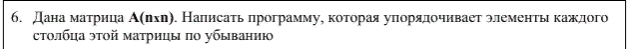
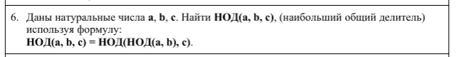
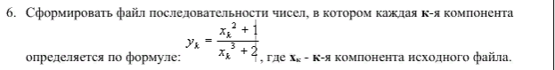

# cpp-ystu-v2
Задания для ЯГТУ по программированию за 2 курс. 

### Мой вариант был 6. Я выполнил все задания согласно методичке.

#### [Задание 1](./variant_6/Section_5)

#### [Задание 2](./variant_6/Section_6)

#### [Задание 3](./variant_6/Section_7)

#### [Задание 4](./variant_6/Section_8)

#### [Задание 5](./variant_6/Section_9)

#### [Задание 6](./variant_6/Section_10)

#### [Задание 7](./variant_6/Section_11)

#### [Задание 8](./variant_6/Section_12)
