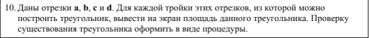

### Новое и непонятное?
Новое           | Пояснение
----------------|----------------------
**bool isEqual(m_row x, m_row y)** | Сравнение 2х векторов "строк"
**bool isSymmetryMatrix(matrix x)** | Сравнение матриц методом симметрии. 

### output - test 1
```
Матрица A(2x2):
   7.68   8.28
   -2.86   0.362
Матрица не симметрична

Матрица B(3x3):
   1   2   1
   2   2   2
   1   2   1
Матрица симметрична.

Матрица C(4x4):
   -5.27   -7.92   2.61   -6.53
   -6.7   9.92   -2.77   3.34
   2.44   -6.35   4.85   -4.54
   -6.07   -0.576   -5.5   -3.81
Матрица не симметрична
```