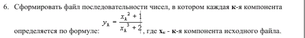

### output - test 1
```
Читаем строку из файла: input.txt
Исходная строка: 8;4;4;5;6;7;8;
Итоговая строка: 0.126459;0.0915229;0.257576;0.0915229;0.257576;0.0915229;0.204724;0.0915229;0.169725;0.0915229;0.144928;0.0915229;0.126459;0.0915229;
Файл out_input.txt сформирован.
```