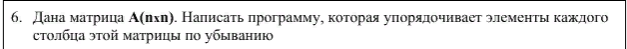

### Новое и непонятное?
Новое           | Пояснение
----------------|----------------------
**matrix rowSort(matrix x, bool desc = true)** | Сортирует матрицу по строкам. По умолчанию - убывание. 
**matrix columnSort(matrix x, bool desc = true)**| Сортирует матрицу по столбцам.

### input
```
n: random value
```

### output - test 1
```
Матрица A(2x2):
   -0.475   -0.535
   -7.69   5.65
Матрица Сортированная по столбцам и убыванию матрица A(2x2):
   -7.69   -0.535
   -0.475   5.65
```

### output - test 2
```
Матрица A(4x4):
   0.909   7.28   -5.75   -4.27
   2.27   -9.07   4.76   -5.73
   8.97   6.42   -9.49   -1.3
   7.92   1.05   1.45   4.85
Матрица Сортированная по столбцам и убыванию матрица A(4x4):
   0.909   -9.07   -9.49   -5.73
   2.27   1.05   -5.75   -4.27
   7.92   6.42   1.45   -1.3
   8.97   7.28   4.76   4.85
```