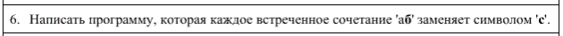

### Новое и непонятное?
Добавлены header файл [any_func.h](../include/any_func.h) туда будут сложены некоторые функции.

Новое           | Пояснение
----------------|----------------------
**std::string ReplaceAll(std::string str, const std::string &from, const std::string &to)** | Заменяет всех вхождения ***from*** на ***to*** в строке. 


### input
```
x: строка введенная с клавиатуры
```

### output - test 1
```
Программа заменит все 'аб' символом 'c'
Введите строку: тест аб=123=аб
Исходная строка: тест аб=123=аб
Итоговая строка: тест c=123=c
```
