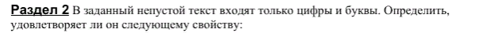
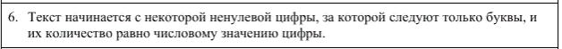

### Новое и непонятное?
Новое           | Пояснение
----------------|----------------------
**bool test_text(string input)** | функция проверяет все условия.


### input
```
x: строка введенная с клавиатуры
```

### output - test 1
```
Исходная строка: 5jasdasd
Не удобалетворяет
```

### output - test 2
```
Исходная строка: 5jasda
Удобалетворяет
```

### output - test 3
```
Исходная строка: -jasdasd123
Не удобалетворяет
```
