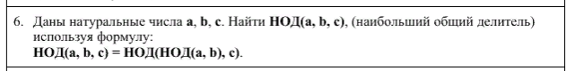

### Новое и непонятное?
Новое           | Пояснение
----------------|----------------------
**int NOD(int a, int b)** | Нахождение наибольшего общего делителя.


### input
```
a,b,c: random value
```

### output - test 1
```
a: 76
b: 28
c:  22

NOD(a, b, c) = NOD(NOD(a, b), c) = 2
```
